# ☁️ CloudVault — Student File Storage System

A cloud-based student file storage application built using **AWS EC2, Amazon S3, IAM, CloudWatch, Flask, and Boto3**.

The application allows students to upload academic files through a web interface and securely store them in Amazon S3. The application also retrieves and displays the files stored in the S3 bucket.

---

## 📌 Project Overview

The main objective of this project is to build a simple cloud-based file storage system using AWS services.

Instead of storing files directly on a local computer, uploaded files are stored in **Amazon S3**, while the Flask web application runs on an **Amazon EC2** instance.

The EC2 instance uses an **IAM Role** to communicate with S3 without storing AWS access keys inside the application.

---

## 🎯 Objectives

- Deploy a web application on AWS EC2.
- Store uploaded files using Amazon S3.
- Use IAM roles for secure AWS service access.
- Monitor the EC2 instance using CloudWatch.
- Build a simple and user-friendly file storage interface.
- Understand how different AWS services work together.

---

## ✨ Features

- 📤 Upload files through a web interface.
- ☁️ Store files in Amazon S3.
- 📂 Display files stored in the S3 bucket.
- 🔐 Use IAM Role-based AWS authentication.
- 🖥️ Flask application hosted on EC2.
- 📊 EC2 monitoring through CloudWatch.
- 📱 Responsive and simple web interface.
- 📦 Maximum upload size of 10 MB.

---

## 🏗️ Architecture

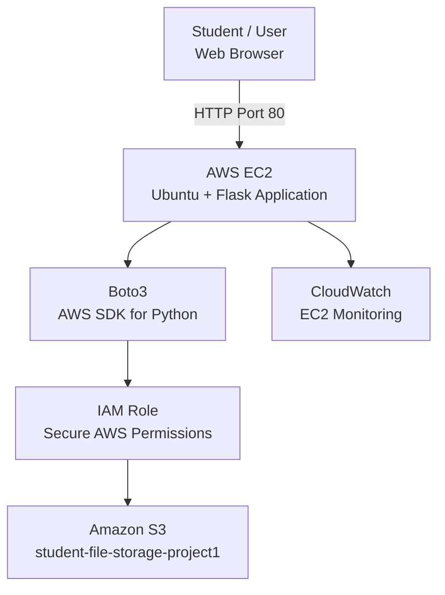
## 🔄 How It Works

1. **User Access**  
   The user opens the CloudVault application using the public IP address of the EC2 instance.

2. **File Upload**  
   The user selects a file through the web interface and clicks **Upload to Cloud**.

3. **Flask Processing**  
   The Flask application running on EC2 receives the uploaded file.

4. **Boto3 Communication**  
   Flask uses the Boto3 AWS SDK to communicate with Amazon S3.

5. **IAM Authorization**  
   The EC2 instance uses its IAM Role to securely access the S3 bucket without storing AWS credentials in the application.

6. **File Storage**  
   Amazon S3 stores the uploaded file as an object.

7. **File Listing**  
   The application retrieves the stored objects from S3 and displays their filenames in the **Stored Files** section.

8. **Monitoring**  
   Amazon CloudWatch provides monitoring information for the EC2 instance, including CPU and network metrics.

---

## ☁️ AWS Services

| AWS Service | Purpose |
|---|---|
| **Amazon EC2** | Hosts the Flask web application |
| **Amazon S3** | Stores uploaded files |
| **AWS IAM** | Provides secure role-based permissions |
| **Amazon CloudWatch** | Monitors the EC2 instance |
| **AWS Systems Manager** | Provides secure access through Session Manager |

---

## 🛠️ Tech Stack

- **Python** — Application programming language
- **Flask** — Web application framework
- **Boto3** — AWS SDK for Python
- **HTML & CSS** — User interface
- **Amazon EC2** — Application hosting
- **Amazon S3** — Cloud file storage
- **AWS IAM** — Access management
- **Amazon CloudWatch** — Monitoring
- **AWS Systems Manager** — Server management
- **Git & GitHub** — Version control

---

## 📁 Project Structure

```text
student-file-storage-aws/
│
├── app.py
├── requirements.txt
├── .gitignore
├── README.md
└── screenshots/
```
---

## ⚙️ Setup

### 1. Clone the repository

```bash
git clone https://github.com/YOUR-GITHUB-USERNAME/student-file-storage-aws.git
cd student-file-storage-aws
```
2. Create a virtual environment
```bash
python3 -m venv .venv
```
4. Activate the virtual environment

Linux/macOS:
```bash
source .venv/bin/activate
```
If source is unavailable:
```bash
. .venv/bin/activate
```
Windows:
```bash
.venv\Scripts\activate
```
4. Install dependencies
```bash
pip install -r requirements.txt
```
6. Configure the S3 bucket
Open app.py and set your S3 bucket name:
```bash
S3_BUCKET = "YOUR_S3_BUCKET_NAME"
```
Replace YOUR_S3_BUCKET_NAME with the name of your own S3 bucket.

6. Run the application
```bash
python3 app.py
```
The application will be available at:
```bash
http://YOUR-SERVER-IP
```
---

## 🔐 Security

The application uses an **IAM Role attached to the EC2 instance** to access Amazon S3.

AWS access keys are not hard-coded into the application.

Sensitive and unnecessary local files are excluded through `.gitignore`:

```text
.venv/
*.pem
.env
.env.*
```
---

---

## 📸 Screenshots

### AWS Infrastructure

#### IAM Configuration

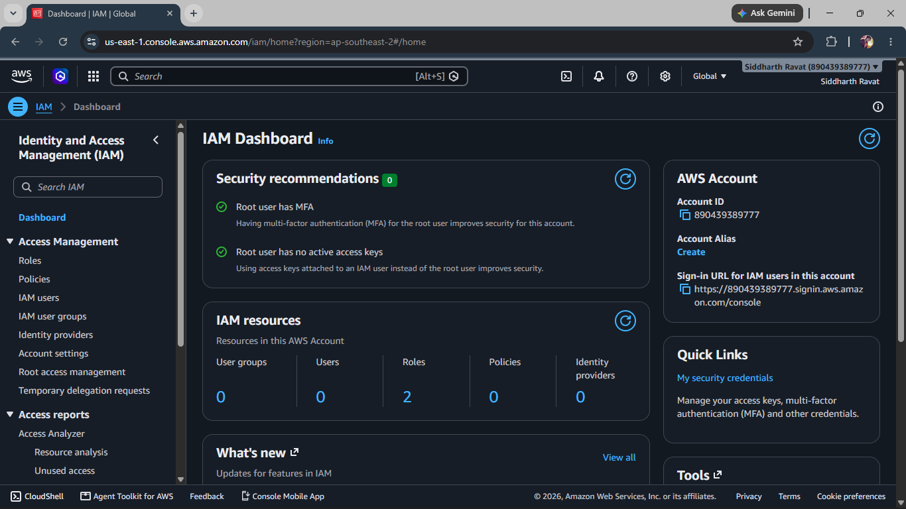

#### EC2 IAM Role

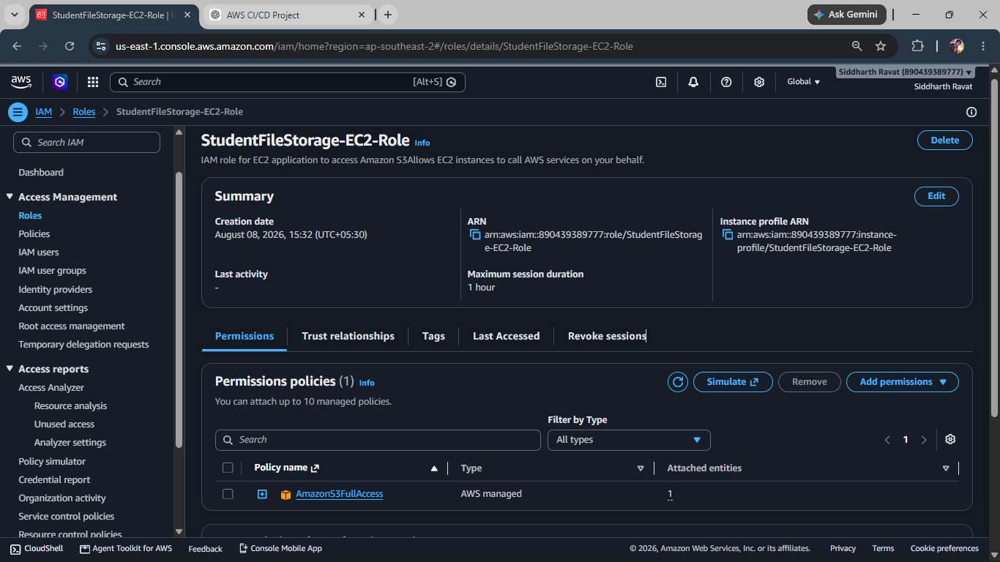

#### S3 Bucket

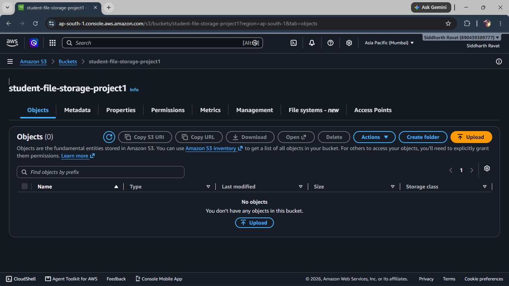

#### EC2 Instance


#### Session Manager

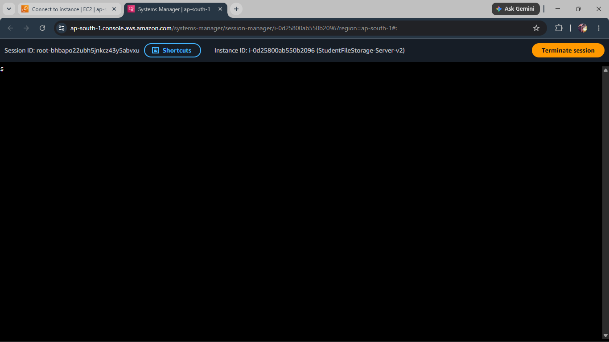

#### Security Group

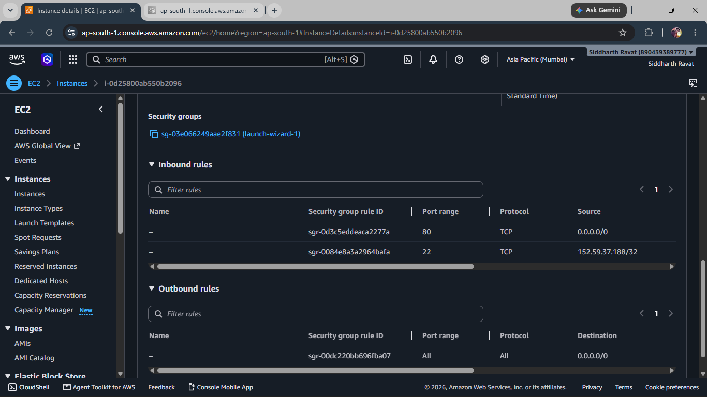

#### IAM Permissions

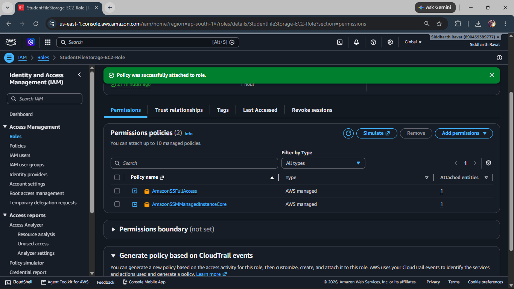

---

### Application

#### CloudVault Application


#### Successful File Upload

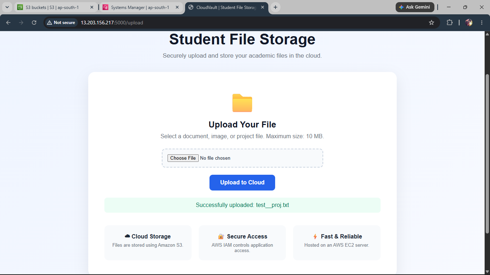

#### File Stored in S3

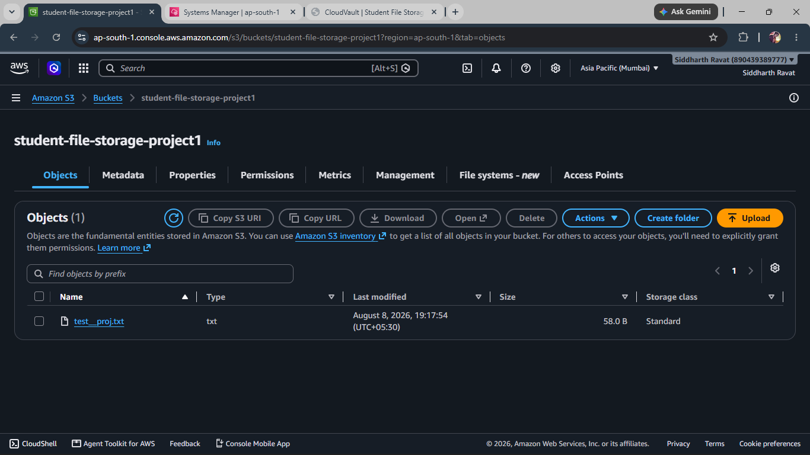

#### Stored Files

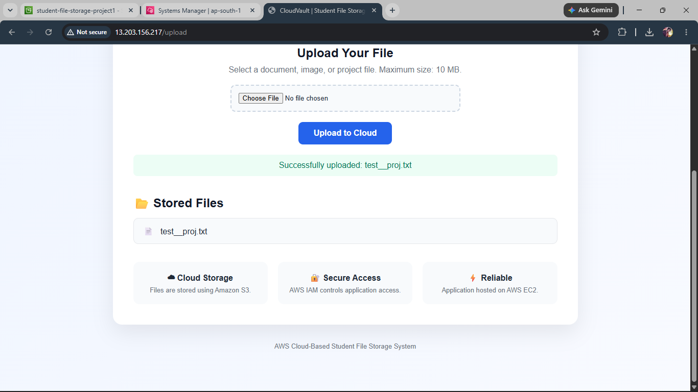

#### Multiple Files

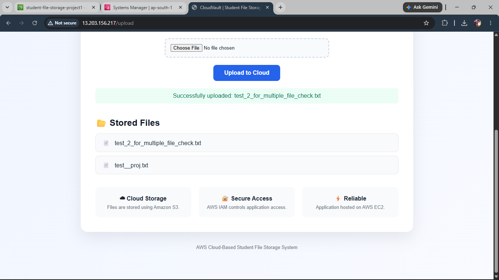

---

### Monitoring

#### EC2 CloudWatch Monitoring

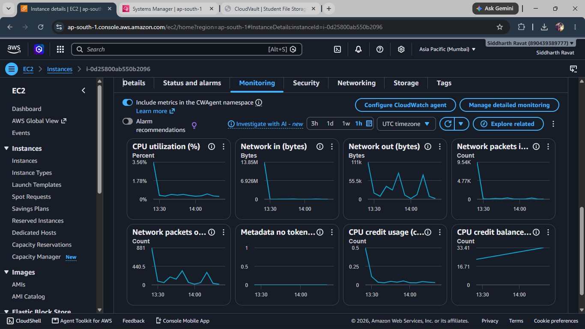

---

## 📊 Results

CloudVault successfully demonstrates a cloud-based file storage workflow using AWS.

Users can upload files through the Flask web application, the files are stored in Amazon S3, and the application retrieves and displays the stored files.

The Flask application is hosted on Amazon EC2, IAM provides secure AWS permissions, and CloudWatch provides EC2 monitoring.

---

## 🔮 Future Improvements

- User authentication
- File download functionality
- File deletion
- File search and filtering
- User-specific storage folders
- File type validation
- HTTPS with a custom domain
- Amazon CloudFront integration
- Improved monitoring and alerting

---

## 👨‍💻 Author

**Siddharth Ravat**
